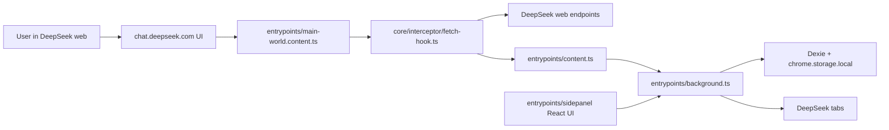

## Project Overview

### Preliminary Direction

Implement Codex-style DeepSeek automations in DeepSeek++: users can click to start an automation in a new DeepSeek chat session, then attach a cron/RRULE-like frequency so future runs continue in that automation session.

### Current Architecture



The extension is a WXT Chrome MV3 extension. It currently augments user-initiated DeepSeek requests from the page main world, then routes local tool execution through content script and background script. The side panel manages memories, skills, presets, settings, WebDAV sync, model mode, and background image settings.

For automations, the safest architecture is to keep scheduling in the background service worker but execute DeepSeek messages from a DeepSeek page main-world runner. This preserves the existing logged-in web session and DeepSeek web challenge/proof-of-work behavior.

### Technology Stack

| Layer | Current | Target for automation |
|:--|:--|:--|
| Language | TypeScript | TypeScript |
| Framework | WXT Chrome MV3 | WXT Chrome MV3 |
| UI | React 19 + Tailwind CSS 4 | Side panel automation page/components |
| Storage | Dexie + chrome.storage.local | New automation store, run state, run history |
| DeepSeek integration | Page fetch/XHR interception | Page main-world runner using `/api/v0/chat/completion` and `/api/v0/chat/history_messages` |
| Scheduler | None | `chrome.alarms` plus due-task scanner |
| Build | `npm run compile`, `npm run build` | Same |

### Entry Points

| Entry point | Responsibility |
|:--|:--|
| `entrypoints/background.ts` | Central message router, persistence orchestration, broadcasts to DeepSeek tabs and side panel |
| `entrypoints/content.ts` | Isolated content script, DOM integration, tool execution, local result rendering |
| `entrypoints/main-world.content.ts` | Main-world script, installs fetch/XHR hooks and syncs runtime state into page context |
| `core/interceptor/fetch-hook.ts` | DeepSeek request augmentation, SSE parsing, tool-call filtering, history cleanup |
| `entrypoints/sidepanel/App.tsx` | Side panel tab shell |
| `entrypoints/sidepanel/pages/SettingsPage.tsx` | Current largest settings surface; candidate reference for compact admin UI patterns |
| `wxt.config.ts` | Manifest permissions and host permissions |

### Build & Run

```bash
npm run compile
npm run build
npm run dev
```

Current `npm run compile` passes before automation changes.

### External Integrations

| Integration | Current use | Automation relevance |
|:--|:--|:--|
| DeepSeek web completion | Existing hook path: `/api/v0/chat/completion` | Primary execution endpoint |
| DeepSeek history | Existing hook path: `/api/v0/chat/history_messages` | Needed to restore message tree and latest parent message |
| DeepSeek web challenge / PoW | Present in current frontend bundle before completion calls | Direct background fetch is risky; page runner should reuse page context |
| Chrome storage | Existing skill/preset/model/background/sync config stores | Store automations, sessions, run records |
| Dexie | Existing memory DB | Candidate for larger run history; chrome storage is enough for task definitions |
| Chrome tabs | Existing broadcast to `*://chat.deepseek.com/*` | Find/open execution tab for automation runner |
| Chrome alarms | Not currently used | Required for scheduled runs |
| WebDAV | Existing optional sync | Out of scope for MVP unless automation sync is explicitly desired |

### Live Validation Notes

Chrome validation on 2026-05-21 verified the desired session behavior in the installed extension environment:

- A new DeepSeek chat session was created by sending a test prompt from the homepage.
- Test session URL: `https://chat.deepseek.com/a/chat/s/5776548f-9cf4-4dd1-8874-9f2bb2c156e2`.
- A second prompt sent from that URL appended to the same conversation.
- Page reload restored both rounds from history, confirming the history chain is persisted.
- The current Chrome automation sandbox cannot directly call page `fetch/XMLHttpRequest`; implementation should be inside the extension's main-world script, not through external browser automation tooling.
