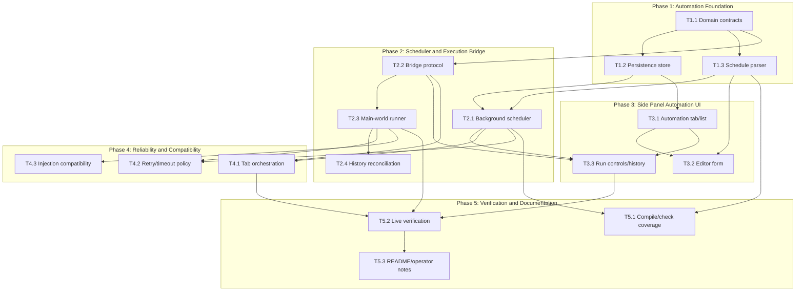

## Task Dependency Graph

### Parallel Execution Notes

- Phase 1 has two lanes after domain contracts: persistence and schedule parsing.
- Phase 2 has a high-conflict bridge/runner lane; avoid concurrent edits to `fetch-hook.ts`, `content.ts`, and `main-world.content.ts`.
- Phase 3 UI work can begin after the store API exists and can use mocked runner responses until Phase 2 is complete.
- Phase 4 should be integrated after the main happy path works.
- Phase 5 verification depends on real DeepSeek page behavior and should not be treated as purely unit-testable.
